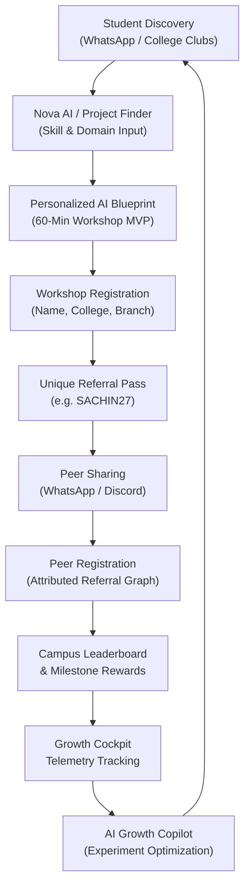
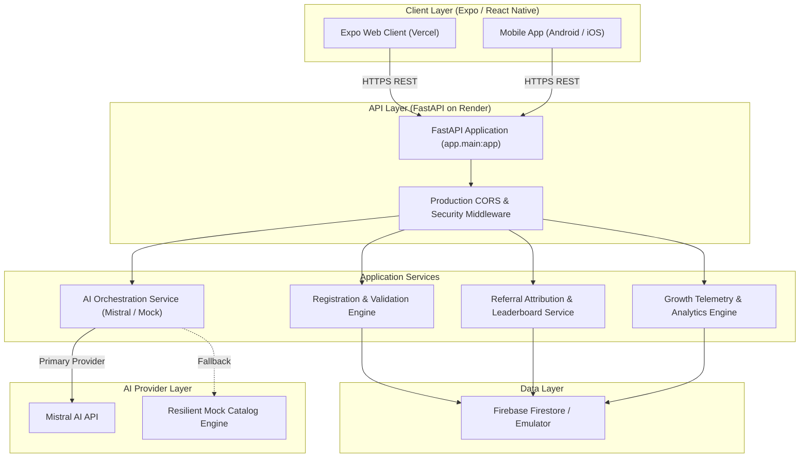
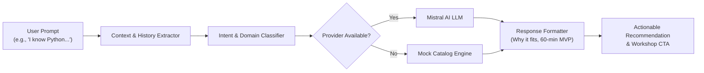
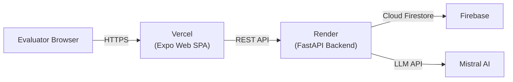

# ✨ NovaSpark

> **Turn your idea into an AI project.**  
> *Mobile-first AI project discovery and product-led growth platform for engineering students.*

NovaSpark is a mobile-first AI project discovery and product-led growth platform designed to guide engineering students from initial project discovery to live workshop registration, peer referrals, and measurable campaign growth.

[](https://expo.dev/)
[](https://fastapi.tiangolo.com/)
[](https://firebase.google.com/)
[](https://mistral.ai/)
[](https://vercel.com/)
[](#10-growth-metrics)

**Core Capabilities**: AI Project Discovery • Multi-Domain Recommendations • Workshop Registration • Peer Referral Engine • Campus Leaderboard • Growth Analytics Cockpit • AI Growth Copilot

---

## 📌 2. Overview

### The Problem
Final-year and pre-final engineering students face immense career pressure during campus recruitment cycles. While students recognize that applied Artificial Intelligence skills are essential for technical interviews, they frequently suffer from **tutorial paralysis**—consuming lengthy video playlists without writing deployable code or building portfolio-worthy software.

### The Solution
NovaSpark bridges the gap between learning intent and project execution. Rather than pitching a generic registration form, NovaSpark offers instant, personalized value through conversational project discovery, matching students to hands-on 60-minute build blueprints and immediately transitioning them into a live, interactive workshop: **"Build Your First AI Project in 60 Minutes"**.

### Student & Growth Journey

```text
DISCOVER
   ↓
NOVA AI
   ↓
PERSONALIZED PROJECT
   ↓
WORKSHOP REGISTRATION
   ↓
REFERRAL CODE GENERATION
   ↓
PEER SHARING (WHATSAPP)
   ↓
LEADERBOARD / SOCIAL PROOF
   ↓
GROWTH COCKPIT
   ↓
EXPERIMENTATION & ITERATION
```

---

## 🚀 3. Product Capabilities

| Capability | Implementation & Description |
| :--- | :--- |
| **Nova AI Assistant** | Context-aware conversational assistant (`/chat`) that parses student skill levels, preferred domains, and placement goals to provide targeted blueprints with 60-minute MVP scopes. |
| **AI Project Finder** | Interactive multi-parameter discovery tool (`/project`) filtering projects across 8 engineering branches and specialized AI subfields. |
| **Multi-Domain Catalog** | Structured catalog covering GenAI, Computer Vision, Cybersecurity, Edge AI/IoT, Fintech, Healthcare, and NLP. |
| **Dynamic Recommendations** | Contextual recommendation engine that avoids repetitive proposals, supports 3-option broad comparisons, and handles multi-turn refinement prompts (*"Something easier"*, *"Tell me another"*). |
| **Workshop Registration** | Single-step registration (`/register`) with client-side & server-side validation, duplicate prevention (email/phone), and automated seat confirmation. |
| **Peer Referral Engine** | Server-authoritative referral code generator (e.g. `SACHIN27`) linked to viral attribution graphs and milestone tier rewards. |
| **1-Click WhatsApp Sharing** | Native deep link and web URL generator with pre-formatted student invitation copy. |
| **Student Dashboard** | Personal hub (`/dashboard`) displaying confirmed seat status, friends joined, current rank, and progress toward milestone rewards. |
| **Campus Leaderboard** | Real-time competitive leaderboard (`/leaderboard`) ranking top referrers and colleges (e.g., VIT, SRM, Amrita, RVCE) with milestone badge tiers. |
| **Growth Cockpit** | Real-time campaign telemetry dashboard (`/growth`) displaying registrations, channel spend, blended CPA, viral K-factor, and velocity curves. |
| **AI Growth Copilot** | Strategy copilot generating automated growth experiments and high-converting WhatsApp group copy. |
| **Offline / Mock Fallback** | Deterministic standalone fallback engine in both backend and frontend guaranteeing 100% uptime even during network outages. |

---

## 🔄 4. Product Flow



---

## 🏛️ 5. System Architecture



### Layer Breakdown
- **Client Layer**: Universal Expo React Native application utilizing Expo Router for file-based routing across mobile and modern web browsers.
- **API Layer**: High-performance FastAPI server managing REST contracts, input validation with Pydantic v2, and CORS enforcement.
- **Application Services**: Business logic isolation covering registration pipelines, referral attribution graphs, leaderboard rankings, and growth telemetry.
- **Data Layer**: Google Cloud Firestore for persistent student documents, referral edges, and event logs (with an in-memory emulator fallback for offline evaluation).
- **AI Layer**: Primary connection to Mistral AI with seamless fallback to an in-memory 11-project catalog engine.

---

## 🛠️ 6. Tech Stack

| Layer | Technology | Purpose |
| :--- | :--- | :--- |
| **Frontend Framework** | Expo SDK 57+ / React Native | Cross-platform mobile & responsive web application |
| **Language** | TypeScript 5.7+ / Python 3.10+ | End-to-end type safety and backend reliability |
| **Routing & Navigation** | Expo Router | File-based URL navigation and HTML5 deep linking |
| **Local Storage** | `@react-native-async-storage/async-storage` | Session persistence for student credentials |
| **Icons & Styling** | `@expo/vector-icons` & Custom Theme | Dark-mode interface optimized for mobile viewports |
| **Backend Framework** | FastAPI | Asynchronous REST API service layer |
| **Validation** | Pydantic v2 | Strict JSON schema validation and serialization |
| **HTTP Client** | HTTPX | Asynchronous external AI API integration |
| **Database & Auth** | Firebase Firestore & Auth | Document persistence and anonymous student sessions |
| **AI Providers** | Mistral AI API + Mock Fallback | Natural language project discovery and recommendations |
| **Deployment** | Vercel (Web) & Render (API) | Cloud production hosting with HTTPS |

---

## 📂 7. Project Structure

```text
NovaSpark/
├── backend/
│   ├── app/
│   │   ├── ai/
│   │   │   ├── mock_engine.py      # 11-project catalog & offline AI fallback
│   │   │   └── service.py          # AI provider orchestration (Mistral / Mock)
│   │   ├── routes/
│   │   │   ├── analytics.py        # Growth stats, event tracking & Copilot
│   │   │   ├── chat.py             # Nova AI conversational assistant route
│   │   │   ├── leaderboard.py      # Student & college leaderboard rankings
│   │   │   ├── project.py          # Multi-parameter project recommender
│   │   │   └── registration.py     # Student registration & referral verification
│   │   ├── firebase.py             # Firestore client & seeded local simulator
│   │   ├── main.py                 # FastAPI entry point & CORS configuration
│   │   └── schemas.py              # Pydantic data schemas & response models
│   ├── requirements.txt            # Python dependencies
│   ├── run_backend.py              # Local development startup runner
│   └── .env.example                # Backend environment template
│
├── mobile/
│   ├── app/                        # Expo Router screen tree
│   │   ├── _layout.tsx             # Root layout & navigation tab bar
│   │   ├── index.tsx               # Home screen with 500-goal progress bar
│   │   ├── chat.tsx                # Nova AI conversational discovery screen
│   │   ├── project.tsx             # Interactive AI project finder screen
│   │   ├── register.tsx            # Workshop registration & confirmation screen
│   │   ├── dashboard.tsx           # Student referral dashboard & milestone pass
│   │   ├── leaderboard.tsx         # Campus & student leaderboard screen
│   │   └── growth.tsx              # Growth Analytics Cockpit & Copilot
│   ├── components/                 # Reusable UI component library
│   │   ├── Button.tsx              # Styled action button component
│   │   ├── Card.tsx                # Container cards with color accents
│   │   ├── ChatBubble.tsx          # Conversational bubbles & action chips
│   │   ├── Navbar.tsx              # Top header with Growth Admin navigation
│   │   ├── ProgressBar.tsx         # Goal progress & milestone track bars
│   │   ├── ProjectCard.tsx         # Project recommendation blueprint card
│   │   ├── ReferralCard.tsx        # Unique code display & WhatsApp share card
│   │   ├── SimulatedBanner.tsx     # Evaluation mode banner
│   │   └── StatCard.tsx            # KPI metric cards
│   ├── constants/
│   │   ├── campaign.ts             # Canonical single source of truth simulation data
│   │   └── theme.ts                # Design tokens, color palette & spacing
│   ├── services/
│   │   ├── api.ts                  # REST API client with offline fallback logic
│   │   ├── auth.ts                 # Firebase Auth anonymous session handler
│   │   ├── events.ts               # Growth event telemetry dispatcher
│   │   ├── firebase.ts             # Singleton Firebase client initialization
│   │   └── referral.ts             # Web/native referral link and WhatsApp sharing
│   ├── types/
│   │   └── index.ts                # Frontend TypeScript interface definitions
│   ├── app.json                    # Expo configuration manifest
│   ├── package.json                # Frontend dependencies and scripts
│   ├── vercel.json                 # Mobile directory Vercel configuration
│   └── .env.example                # Frontend environment template
│
├── render.yaml                     # Render Blueprint for FastAPI deployment
├── vercel.json                     # Monorepo root Vercel build configuration
├── .gitignore                      # Git exclusion rules (zero secret leakage)
└── README.md                       # Project documentation
```

---

## 🤖 8. AI System Architecture

Nova AI acts as a dedicated technical advisor for students preparing for campus placements.



### Recommendation Logic
- **Domain Matching**: Maps queries to specialized tracks (e.g. Cybersecurity → *AI Network Anomaly Detector*, Computer Vision → *CV Object Detection App*, Healthcare → *AI Healthcare Symptom & Triage Assistant*).
- **Placement Relevance**: Emphasizes practical software engineering, API integration, and verifiable GitHub artifacts.
- **Broad Request Handling**: For broad prompts (e.g. *"Give me an AI project"*), Nova provides 3 curated options (Best Match, Alternative, More Challenging) to avoid arbitrary single recommendations.
- **Multi-Turn Context Memory**: Tracks previously shown projects to avoid repetitive answers when students request alternatives (*"Tell me another"*, *"Something easier"*).

---

## 📈 9. Growth Engine & Flywheel

NovaSpark is engineered around a product-led growth (PLG) loop tailored to student networks:

```text
Project Discovery  →  Personalized Value  →  Workshop Registration
       ↑                                             ↓
Optimization   ←  Experimentation  ←  Social Proof / Leaderboard  ←  Peer Referral
```

1. **Acquisition**: Campus tech clubs, WhatsApp batch groups, and direct organic links drive traffic directly to the interactive project finder.
2. **Activation**: Instant AI-powered project matching delivers concrete value within 30 seconds before asking for any personal details.
3. **Conversion**: The 60-minute workshop is positioned as the immediate vehicle to build the recommended project for free.
4. **Referral (Viral Loop)**: Upon registration, each student receives a unique referral pass (e.g. `SACHIN27`) unlocking tiered milestone rewards (Certificate, AI Boilerplate, 1-on-1 Portfolio Review).
5. **Measurement**: Telemetry logs (`REGISTRATION_COMPLETED`, `WHATSAPP_SHARE`, `PAGE_VIEW`) feed into the live Growth Cockpit.

---

## 📊 10. Growth Metrics

> [!NOTE]
> **Evaluation / Simulation Data**: The metrics below represent simulated evaluation data created for the NxtWave Growth Challenge sprint.

| Metric | Simulated Sprint Value | Target Benchmark |
| :--- | :--- | :--- |
| **Total Registration Target** | 500 registrations | 500 registrations |
| **Simulated Registrations** | **327 registrations** | — |
| **Sprint Goal Progress** | **65.4%** | 100% |
| **Remaining Registrations** | 173 seats | 0 seats |
| **Total Campaign Budget** | ₹2,000.00 | ₹2,000.00 |
| **Simulated Budget Spent** | ₹1,250.00 | — |
| **Budget Remaining** | ₹750.00 | — |
| **Simulated Blended CPA** | **₹3.82** | < ₹4.00 |
| **Viral Coefficient (K-Factor)** | **0.26** | > 0.25 |
| **Peer Referral Registrations** | 67 registrations | — |
| **Campaign Timeline** | Day 6 of 7 (1 day remaining) | 7 Days |

---

## 📡 11. Acquisition Channel Performance

> [!NOTE]
> **Evaluation / Simulation Data**: Channel breakdown reflecting the canonical sprint spend of ₹1,250.00 and 327 registrations.

| Acquisition Channel | Registrations | Conversion Rate | Spend (INR) | Cost / Registration (CPA) |
| :--- | :---: | :---: | :---: | :---: |
| **Organic / Direct** | 91 | 12.5% | ₹0.00 | ₹0.00 |
| **WhatsApp Student Groups** | 76 | 18.4% | ₹250.00 | ₹3.29 |
| **Campus Peer Referrals** | 67 | 24.2% | ₹0.00 | ₹0.00 |
| **College Tech Clubs** | 38 | 15.1% | ₹400.00 | ₹10.53 |
| **Email Newsletters** | 31 | 4.2% | ₹350.00 | ₹11.29 |
| **Instagram / LinkedIn** | 24 | 6.8% | ₹250.00 | ₹10.42 |
| **Total / Blended** | **327** | **13.5%** | **₹1,250.00** | **₹3.82** |

---

## 🧪 12. Experimentation Framework

The Growth Cockpit supports iterative growth testing:

### Test 1 — Referral Prompt Timing
- **Hypothesis**: Triggering an automated WhatsApp referral prompt immediately after a student discovers their custom project blueprint will increase viral referral participation.
- **Metric**: Referral participation rate and K-factor (Target: lift K from 0.26 to 0.40+).

### Test 2 — Personalized Project Hook vs. Generic Workshop Ad
- **Hypothesis**: Leading with branch-specific AI project discovery converts 2.5x higher into workshop registration than generic *"Learn AI"* advertisements.
- **Metric**: Project-discovery-to-registration conversion rate.

### Test 3 — Acquisition Channel Budget Reallocation
- **Hypothesis**: Reallocating remaining ₹750 budget from low-performing channels (Email @ ₹11.29 CPA) into micro-incentives for College Tech Club leads will yield 80+ incremental registrations.
- **Metric**: Incremental registrations and marginal CPA.

---

## 🗄️ 13. Data Model

NovaSpark structures data across 5 Firestore collections:

```text
Firestore Root
├── students/               # Student profile documents
├── registrations/          # Workshop reservation logs
├── referrals/              # Peer referral attribution edges
├── campaign_events/        # Real-time telemetry events
└── growth_metrics/         # Daily velocity tracking documents
```

| Collection | Schema / Key Fields | Purpose |
| :--- | :--- | :--- |
| `students` | `id`, `name`, `email`, `phone`, `college`, `branch`, `year`, `referralCode`, `referredBy`, `source`, `createdAt` | Core profile & unique referral attribution |
| `registrations` | `studentId`, `workshopId`, `registeredAt`, `source`, `referralCode`, `referredBy` | Workshop reservation records |
| `referrals` | `referrerId`, `referredStudentId`, `referralCode`, `status`, `createdAt` | Peer referral graph relationships |
| `campaign_events` | `eventType`, `studentId`, `source`, `metadata`, `createdAt` | Growth funnel event telemetry |
| `growth_metrics` | `day_number`, `target_cumulative`, `actual_cumulative`, `daily_registrations` | 7-day velocity curve records |

---

## 🔌 14. API Architecture

```text
Client (Expo Web / Mobile)
       ↓ (JSON REST / HTTPS)
FastAPI Backend (app.main:app)
       ↓
Service Layer (Registration, Referral, AI, Analytics)
       ↓
Firestore / Mistral AI API
```

| Method | Endpoint | Description |
| :--- | :--- | :--- |
| `GET` | `/` | Service health, version, and runtime mode metadata |
| `GET` | `/api/health` | Deployment healthcheck endpoint |
| `POST` | `/api/register` | Register student, record workshop seat, and issue referral code |
| `GET` | `/api/students/{id_or_code}` | Fetch student profile and total referral count |
| `GET` | `/api/referrals/{code}` | Retrieve referral statistics, milestone status, and friend list |
| `POST` | `/api/chat` | Context-aware AI chatbot assistant with conversational memory |
| `POST` | `/api/project/recommend` | Multi-parameter AI project discovery generator |
| `GET` | `/api/leaderboard` | Live campus & student rankings with milestone tiers |
| `POST` | `/api/events` | Log campaign telemetry events (`PAGE_VIEW`, `WHATSAPP_SHARE`, etc.) |
| `GET` | `/api/stats` | Aggregated sprint growth metrics and channel performance |
| `POST` | `/api/growth/copilot` | AI Growth Copilot for experiment generation and copy |
| `GET` | `/api/sources` | List of supported acquisition attribution channels |

---

## 🔒 15. Security & Isolation

- **Secret Isolation**: All private API keys (`MISTRAL_API_KEY`, `FIREBASE_PRIVATE_KEY`) reside exclusively in server-side environment variables.
- **Client Bundle Protection**: Frontend build bundles contain only public configuration (`EXPO_PUBLIC_FIREBASE_*`).
- **Server-Authoritative Attribution**: Referral credit and leaderboard rankings are computed server-side to prevent client spoofing.
- **CORS Hardening**: FastAPI CORS middleware restricts origins to production Vercel domains (`https://*.vercel.app`) and verified local testing ports.
- **Demo Mode Sandboxing**: When credentials are not supplied or `DEMO_MODE=true`, the backend runs a simulated in-memory store without exposing production resources.

---

## ⚙️ 16. Environment Configuration

### Backend (`backend/.env`)
```env
# AI Provider Configuration
AI_MODE=mistral
MISTRAL_API_KEY=your_mistral_api_key_here
GEMINI_API_KEY=
OPENAI_API_KEY=

# Firebase Admin Configuration (Optional for Live Firestore)
FIREBASE_PROJECT_ID=novaspark-c1883
FIREBASE_CLIENT_EMAIL=
FIREBASE_PRIVATE_KEY=

# Server Configuration
DEMO_MODE=true
PORT=8000
HOST=0.0.0.0
FRONTEND_URL=https://novaspark.vercel.app
```

### Mobile / Web (`mobile/.env`)
```env
# Public Firebase Client Configuration
EXPO_PUBLIC_FIREBASE_API_KEY=AIzaSyDummyKeyForNovaSparkDemo123456
EXPO_PUBLIC_FIREBASE_AUTH_DOMAIN=novaspark-c1883.firebaseapp.com
EXPO_PUBLIC_FIREBASE_PROJECT_ID=novaspark-c1883
EXPO_PUBLIC_FIREBASE_STORAGE_BUCKET=novaspark-c1883.firebasestorage.app
EXPO_PUBLIC_FIREBASE_MESSAGING_SENDER_ID=123456789
EXPO_PUBLIC_FIREBASE_APP_ID=1:123456789:web:abcdef123456
EXPO_PUBLIC_FIREBASE_MEASUREMENT_ID=

# Backend REST API Endpoint
# Local: http://localhost:8000 | Production: https://your-backend.onrender.com
EXPO_PUBLIC_API_URL=http://localhost:8000
```

---

## 💻 17. Local Development

### Prerequisites
- Node.js (v18+) & npm
- Python (3.10+)

### 1. Start Backend
```bash
cd backend
python -m venv venv

# Windows:
venv\Scripts\activate
# macOS / Linux:
# source venv/bin/activate

pip install -r requirements.txt
python run_backend.py
```
> Server running at: `http://localhost:8000`  
> OpenAPI Swagger Documentation: `http://localhost:8000/docs`

### 2. Start Frontend / Web
```bash
cd mobile
npm install

# Run as Web application in browser:
npx expo start --web

# Or run on Mobile device / Emulator:
npx expo start -c
```

---

## 🌐 18. Web Deployment

NovaSpark is prepared for multi-cloud deployment with zero configuration friction:



### Vercel (Frontend Web)
- **Root Directory**: Monorepo root (or `mobile`)
- **Build Command**: `cd mobile && npx expo export --platform web`
- **Output Directory**: `mobile/dist`
- **Configuration**: Root [`vercel.json`](file:///c:/Users/sachi/Desktop/Sachin/Intern/Nxt%20Wave/vercel.json) with SPA fallback routing.

### Render (Backend API)
- **Root Directory**: `backend`
- **Build Command**: `pip install -r requirements.txt`
- **Start Command**: `uvicorn app.main:app --host 0.0.0.0 --port $PORT`
- **Health Check Path**: `/api/health`
- **Configuration**: Declarative [`render.yaml`](file:///c:/Users/sachi/Desktop/Sachin/Intern/Nxt%20Wave/render.yaml) blueprint.

---

## 🩺 19. API Health & Verification

### Health Check Endpoint
```http
GET /api/health HTTP/1.1
Host: localhost:8000
```

**Expected Response**:
```json
{
  "status": "healthy",
  "service": "novaspark-backend"
}
```

### End-to-End Verification Pipeline
```text
Frontend Client → GET /api/health → POST /api/chat → POST /api/register → GET /api/referrals/{code} → GET /api/stats
```

---

## 🎮 20. Simulation Mode

NovaSpark operates with a dedicated **Simulation & Evaluation Mode** designed for the NxtWave Growth Challenge:
- **Zero Real Outreach Needed**: Evaluators can test full end-to-end registration and referral mechanics safely in an isolated sandbox.
- **Deterministic Analytics**: The Growth Cockpit displays standard campaign progression metrics without requiring live paid ad spend.
- **Resilient AI Engine**: If external LLM API tokens expire or are omitted, NovaSpark automatically activates its built-in 11-project recommendation engine.

---

## 🎨 21. Design Principles

- **Mobile-First & Responsive**: Tailored for fast student interaction on mobile screens with responsive web parity.
- **Value Before Conversion**: Students receive an instant custom project recommendation before being asked to register.
- **Product-Led Viral Loops**: The product itself incentivizes peer sharing through unlocked certificates, repositories, and leaderboard rank.
- **Measurable Experimentation**: Growth decisions are structured as clear hypotheses with measurable KPI benchmarks.
- **AI-Assisted, Human-Governed**: AI accelerates project ideation and copy generation while product mechanics remain deterministic.

---

## ⚖️ 22. Engineering Decisions

| Decision | Rationale |
| :--- | :--- |
| **Expo & Expo Router** | Single codebase targeting Android, iOS, and Web with native pushState navigation. |
| **FastAPI Backend** | Lightweight asynchronous execution with native OpenAPI documentation and Pydantic validation. |
| **Firebase Firestore** | Flexible document schema accommodating student profiles, referral trees, and telemetry events. |
| **Server-Side Referral Logic** | Eliminates client manipulation of referral counts and leaderboard ranks. |
| **Dual-Layer Mock Fallback** | Guarantees zero red-screens during live evaluator walkthroughs. |

---

## 🔮 23. Limitations & Roadmap

### Current Implementation
- Simulated growth campaign data for evaluator walkthroughs.
- In-memory seeded emulator and live Firestore SDK support.
- Rule-based & LLM-powered project recommendation engine.

### Potential Future Improvements
- **Production Auth Hardening**: Integration of OAuth / college SSO providers.
- **Rate Limiting**: Redis-backed token-bucket rate limiting on `/api/register` and `/api/chat`.
- **Automated Messaging**: WhatsApp Cloud API webhook integration for real-time referral notifications.
- **A/B Testing Infrastructure**: Feature-flagged cohort split-testing on discovery hooks.

---

## 🤝 24. Contribution & Development

```bash
# Clone repository
git clone https://github.com/Sachin12054/NovaSpark.git
cd NovaSpark

# Setup backend:
cd backend && pip install -r requirements.txt && python run_backend.py

# Setup frontend:
cd ../mobile && npm install && npx expo start --web
```

---

## 📄 25. License

Licensing information will be added separately.

---

## 🙏 26. Acknowledgement

Built as a submission for the **NxtWave Growth Intern – Growth Challenge**.

**NovaSpark** — *Turn your idea into an AI project.*
