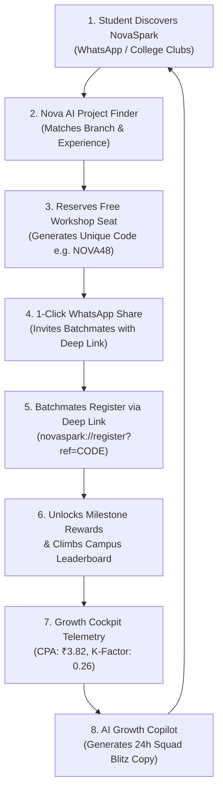

# ✨ NovaSpark

> **Turn your idea into an AI project.**  
> *Submission for NxtWave Growth Intern – Growth Challenge*  
> *Mobile-First Prototype: 500 Engineering Student Registrations in 7 Days at ₹2,000 Budget*

[](https://expo.dev/)
[](https://firebase.google.com/)
[](https://fastapi.tiangolo.com/)
[](https://mistral.ai/)
[](#)

---

## 📌 1. Product Overview & Problem Statement

### The Problem
Final-year engineering students face career anxiety during campus placement cycles. While they recognize the urgency of mastering AI, they frequently suffer from **tutorial paralysis**—watching 10-hour lecture playlists without building real-world software to put on their resume.

### The Solution: NovaSpark
**NovaSpark** is an AI-powered growth mobile app that matches students to tailored 60-minute build blueprints and immediately funnels them into a live, interactive workshop:
> **"Build Your First AI Project in 60 Minutes"**

---

## 🔄 2. Viral Growth Flywheel & Strategy



---

## 🏛️ 3. System Architecture & Tech Stack

```
                    ┌────────────────────────────────┐
                    │      EXPO MOBILE APP           │
                    │  React Native / TypeScript     │
                    │  (Android / iOS / Expo Go)     │
                    └───────────────┬────────────────┘
                                    │
                         REST / HTTPS JSON API
                                    │
                    ┌───────────────▼────────────────┐
                    │       FASTAPI BACKEND          │
                    │  Referral Engine & Validation  │
                    │  AI Orchestration Service      │
                    │  Campaign Telemetry Analytics  │
                    └────────┬──────────────┬────────┘
                             │              │
                     Firebase Firestore    Mistral AI / LLM
                             │              │
                    ┌────────▼────────┐ ┌───▼────────┐
                    │    FIRESTORE    │ │ MISTRAL AI │
                    │ (novaspark-c1883│ │ (or Mock)  │
                    └─────────────────┘ └────────────┘
```

- **Frontend**: Expo React Native (SDK 57+), TypeScript, Expo Router, `@react-native-async-storage/async-storage`.
- **Backend**: FastAPI (Python 3.10+), Pydantic v2, Uvicorn, HTTPX.
- **Database & Auth**: Google Cloud Firestore (Admin SDK on backend, Client SDK on mobile with persistent session storage).
- **AI Engine**: Mistral AI API with graceful timeout/retry resilience and standalone `mock_engine.py` fallback.

---

## 🔒 4. Security & Environment Architecture

1. **Zero Secret Leakage**: All `.env` files are strictly excluded via `.gitignore`.
2. **Backend Credential Isolation**: Private AI keys (`MISTRAL_API_KEY`, `OPENAI_API_KEY`, `GEMINI_API_KEY`) and Firebase Admin service accounts remain strictly on the backend.
3. **Server-Authoritative Metrics**: Referral attributions, leaderboard ranks, and milestone awards are calculated server-side to prevent client manipulation.
4. **Resilient Offline Demo Fallback**: When `DEMO_MODE=true` or network services are unreachable, NovaSpark operates smoothly in offline mode with complete simulated telemetry.

---

## 🔑 5. Environment Variables Setup

### Backend (`backend/.env`)
```env
AI_MODE=mistral
MISTRAL_API_KEY=your_mistral_api_key_here
GEMINI_API_KEY=
OPENAI_API_KEY=

# Firebase Firestore Configuration (Backend Admin)
FIREBASE_PROJECT_ID=novaspark-c1883
FIREBASE_CLIENT_EMAIL=
FIREBASE_PRIVATE_KEY=

# Demo / Simulation Mode (true runs with local mock store)
DEMO_MODE=true
PORT=8000
HOST=0.0.0.0
```

### Mobile App (`mobile/.env`)
```env
EXPO_PUBLIC_FIREBASE_API_KEY=your_firebase_web_api_key
EXPO_PUBLIC_FIREBASE_AUTH_DOMAIN=novaspark-c1883.firebaseapp.com
EXPO_PUBLIC_FIREBASE_PROJECT_ID=novaspark-c1883
EXPO_PUBLIC_FIREBASE_STORAGE_BUCKET=novaspark-c1883.firebasestorage.app
EXPO_PUBLIC_FIREBASE_MESSAGING_SENDER_ID=your_messaging_sender_id
EXPO_PUBLIC_FIREBASE_APP_ID=your_firebase_app_id
EXPO_PUBLIC_FIREBASE_MEASUREMENT_ID=your_measurement_id

# Backend REST API Endpoint
EXPO_PUBLIC_API_URL=http://localhost:8000
```

---

## 🚀 6. Running Locally

### Terminal 1: Backend (FastAPI + Python)
```bash
cd backend
python -m venv venv

# Windows:
venv\Scripts\activate
# macOS / Linux:
# source venv/bin/activate

pip install -r requirements.txt
python run_backend.py
```
> Backend: `http://localhost:8000`  
> Interactive OpenAPI Swagger Docs: `http://localhost:8000/docs`

### Terminal 2: Mobile App (Expo)
```bash
cd mobile
npm install
npx expo start -c
```
*(Or run `npx expo start --tunnel -c` for seamless remote mobile pairing across any network).*

---

## 🗄️ 7. Firestore Collections & Schema

| Collection | Key Fields | Purpose |
|---|---|---|
| `students` | `id`, `name`, `email`, `phone`, `college`, `branch`, `year`, `referralCode`, `referredBy`, `source`, `createdAt` | Core student profile & referral code |
| `registrations` | `studentId`, `workshopId`, `registeredAt`, `source`, `referralCode`, `referredBy` | Workshop reservation records |
| `referrals` | `referrerId`, `referredStudentId`, `referralCode`, `status`, `createdAt` | Peer referral attribution graph |
| `campaign_events` | `eventType`, `studentId`, `source`, `metadata`, `createdAt` | Growth funnel telemetry |
| `growth_metrics` | `day_number`, `target_cumulative`, `actual_cumulative`, `daily_registrations` | Campaign progress tracking |

---

## 🎬 8. Exact 3-Minute Interview Demo Flow

1. **Home Screen (Phase 4):** Open NovaSpark. Show the value proposition *"Turn your idea into an AI project."*, the animated **327 / 500 Goal Bar**, and simulated campaign banner.
2. **AI Project Finder (Phase 6):** Tap **"Build My AI Project"**. Select *CSE + Final Year + Beginner + Generative AI*. Tap **Generate My Custom AI Project** to view the **AI Resume Analyzer & ATS Score Matcher** blueprint.
3. **Workshop Registration (Phase 7):** Tap **"Build this project in the workshop →"**. Enter your details. Tap submit to see the *"You're in! 🎉"* confirmation and dynamic unique referral code.
4. **Viral WhatsApp Share (Phase 9):** Tap **"Share on WhatsApp"** to demo the prefilled invitation copy with the deep link (`novaspark://register?ref=...`).
5. **Nova AI Assistant (Phase 5):** Open **Nova AI**. Tap quick chips like *"Give me a project"*, *"I'm a beginner"*, or *"Is the workshop free?"* to demonstrate contextual intelligence and 1-click workshop reservation CTAs.
6. **Student Dashboard (Phase 8):** Open the **Dashboard**. Show the confirmed workshop pass, friends who joined via referral, rank, and the milestone reward progress bar.
7. **Campus Leaderboard (Phase 10):** Tap **"View Leaderboard"**. Switch between **Top Students** (🥇 1, 🥈 2, 🥉 3) and **Top Colleges** (VIT, SRM, Amrita) and highlight the current student.
8. **Growth Admin Cockpit (Phase 11 & 12):** Open the **Growth** tab. Walk through the 327/500 registrations, **₹3.82 blended CPA vs ₹2,000 budget**, 7-day velocity chart, and tap **"Generate Experiment"** / **"WhatsApp Copy"** in the **AI Growth Copilot**.

---

*Submission for NxtWave Growth Intern Challenge.*
